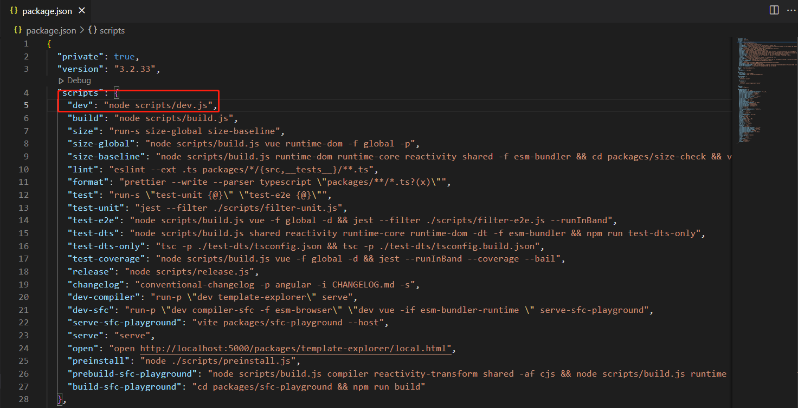
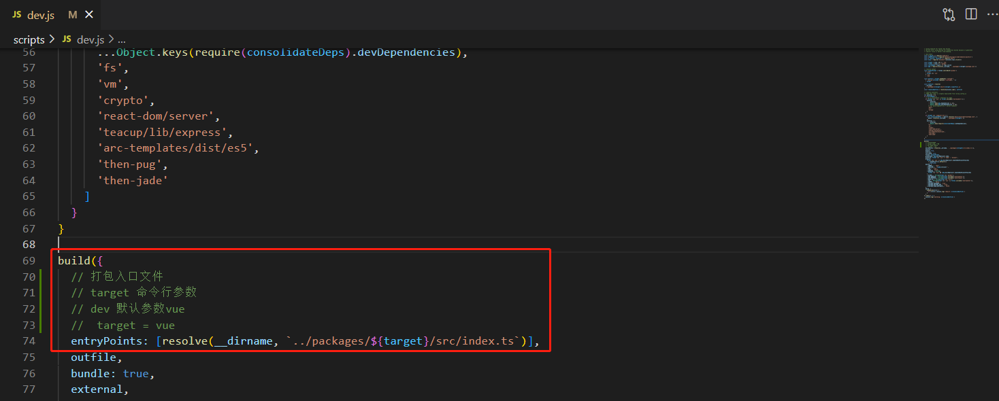
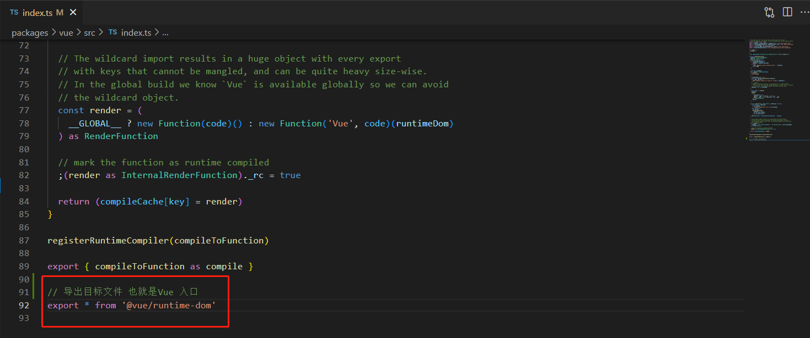

###### 第一步 下载 Vue3 项目源码
```
git clone https://github.com/vuejs/core
```
###### 第二步 安装 pnpm 
```
npm install pnpm -g
```
###### 第三步 安装依赖
```
pnpm install
``` 
###### 第四步 分析 package.json

###### 第五步 找到 scripts/dev.js 文件

###### 第六步 找到 packages/vue/src/index 文件



